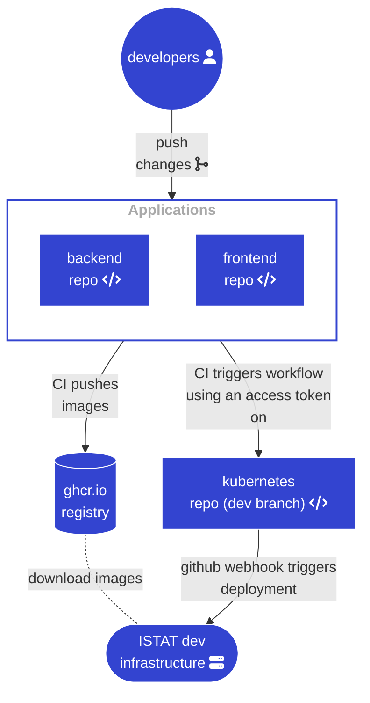

# dati-semantic-kubernetes

This is the configuration repository for the [schema.gov.it](schema.gov.it).

We use branch based environments to manage the configuration. The branch name is the environments it applies to.

## Environments

- [dev](https://github.com/teamdigitale/dati-semantic-kubernetes/tree/dev)
- [test](https://github.com/teamdigitale/dati-semantic-kubernetes/tree/test)
- [prod](https://github.com/teamdigitale/dati-semantic-kubernetes/tree/prod)

## Deliverables

The deliverables' repositories are:

- The NDC application:
  - https://github.com/teamdigitale/dati-semantic-backend
  - https://github.com/teamdigitale/dati-semantic-frontend

- Semantic viewers:
  - https://github.com/teamdigitale/dati-semantic-lodview
  - https://github.com/teamdigitale/LODE
  - https://github.com/teamdigitale/dati-semantic-WebVOWL

## Automation (Only for the `dev` environment)

Deployment to dev is automatic whenever there is a change in BE or FE app.

## Promoting to `test`

This is a partially automated. Developers are expected to manually promote the `dev` configuration to `test` branch.

Once developer pushed his config changes to `test` branch, ISTAT will recieve a webhook and will start the deployment
process.

## Promoting to `prod`

This is totally manual process. 
Developers are expected to manually promote the `test` configuration to `prod` branch.

Then they should request the deployment of the `prod` configuration to ISTAT over the email.
