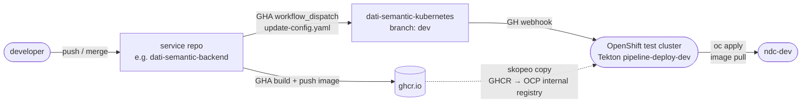

[](https://github.com/teamdigitale/dati-semantic-kubernetes/blob/main/LICENSE)
[](https://github.com/teamdigitale/dati-semantic-kubernetes/issues)

# dati-semantic-kubernetes

GitOps-style configuration repository for the [`schema.gov.it`](https://www.schema.gov.it) platform, a.k.a. the **National Data Catalog (NDC) for Semantic Interoperability**. This repository contains the Kubernetes/OpenShift manifests for every service of the platform, organised on a **branch-per-environment** model. Pushes to these branches trigger automated deployments to the corresponding OpenShift environments via a Tekton pipeline running in the cluster.

The repository acts as the **single source of truth** for what is deployed where: the running state of every environment is reproducible from the contents of the corresponding branch.

## Branch model

| Branch | Environment | OpenShift cluster | Promotion |
| :-- | :-- | :-- | :-- |
| `main` | (workflow templates, documentation) | — | Not deployed. Holds the GitHub Actions sources and the canonical README; merges into `dev` are manual. |
| `dev` | `ndc-dev` | ARO test cluster (`cloudpub.testedev.istat.it`) | **Automatic**: image bumps are committed by the GitHub Actions of the service repositories (see [Automation](#automation)) and the resulting push triggers the Tekton pipeline. |
| `test` | `ndc-test` | Same ARO test cluster | **Manual**: developers promote a curated subset of `dev` to `test` via PR. CODEOWNERS approval required. |
| `prod` | `ndc-prod` | Separate ARO prod cluster (`cloudpub.istat.it`) | **Manual + blue/green**: developers promote `test` to `prod` via PR; OpenShift Tekton picks the inactive slot (blue or green), deploys there, and a separate manual pipeline performs the route cutover. |

## Repository layout

Each environment branch follows the same top-level layout: one folder per deployed service, plus a folder of cross-service "external service" bridges.

```
.
├── dati-semantic-backend/
├── dati-semantic-frontend/
├── dati-semantic-lode/
├── dati-semantic-lodview/
├── dati-semantic-webvowl/
├── dati-semantic-wordpress/
├── dati-semantic-csv-api/                  (dev only)
├── dati-semantic-csv-apis-data/            (dev only)
├── dati-semantic-schema-editor/            (dev only)
├── dati-semantic-schema-editor-api/        (dev only)
├── dati-semantic-schema-editor-api-pdnd/   (dev only)
├── external-services/
├── updateImage.sh
├── LICENSE
├── README.md
└── .github/
    ├── CODEOWNERS
    └── workflows/
        ├── update-config.yaml
        ├── update-schema-editor-images.yaml
        └── super-linter.yaml
```

### Per-service folder

Each `dati-semantic-<service>/` folder contains the standard set of Kubernetes/OpenShift manifests:

| File | Purpose |
| :-- | :-- |
| `deployment.yaml` | Pod template, container image reference, environment variables, replicas. The image tag here is the one that the GitHub Actions of the service repository will update. |
| `service.yaml` | `ClusterIP` Service that exposes the pod inside the namespace. |
| `route.yaml` | OpenShift `Route` (HTTPS edge termination) that exposes the service to the outside on the appropriate hostname. |
| `configmap.yaml` | Non-secret configuration (e.g. application properties). |
| `imagestream.yaml` | OpenShift `ImageStream`, target of the in-cluster `skopeo copy` from GHCR. |
| `autoscaling.yaml` | `HorizontalPodAutoscaler` for the service. |

Sensitive data (`*_PASSWORD`, GitHub PATs, …) are **not** stored in this repository: the manifests reference Kubernetes `Secret` objects that exist out-of-band in each namespace.

### `external-services/`

Contains the manifests that expose **off-cluster** services to the in-cluster workloads:

- `elasticsearch-external-{service,endpoints,routes}.yaml`
- `virtuoso-external-{service,endpoints,routes}.yaml`
- `mysql-external-{service,endpoints,routes}.yaml` (dev only — in test and prod, MySQL is reached directly via its Azure Private Link FQDN by the application)

Each "external service" is implemented as a Kubernetes `Service` **without pod selector** plus a manually-defined `Endpoints` object that points at the private IP of the backing VM. This makes the off-cluster Elasticsearch, Virtuoso and (in dev) MySQL look like normal in-cluster services to the application pods.

## Automation

### Per-service workflow: GitHub Actions → kubernetes `dev` branch

After a service repository (e.g. `dati-semantic-backend`) builds and pushes a new image to `ghcr.io`, its GitHub Actions pipeline triggers a `workflow_dispatch` on **this repository**'s `update-config.yaml` workflow, targeting the `dev` branch:

1. The service workflow calls [`convictional/trigger-workflow-and-wait`](https://github.com/convictional/trigger-workflow-and-wait) with `serviceName=<repo>` and `imageWithNewTag=<image>:<tag>`.
2. `update-config.yaml` checks out `dev` and runs [`updateImage.sh`](./updateImage.sh), which uses `yq` to rewrite the image reference in `<serviceName>/deployment.yaml`.
3. The workflow commits the change to `dev` as `Github action user <gh-actions-user@users.noreply.github.com>` and pushes.
4. The push to `dev` notifies a GitHub webhook that targets the OpenShift Tekton EventListener (`el-github-listener-interceptor`) in the `dev-ops` namespace of the test cluster, which fires `pipeline-deploy-dev`.


```mermaid
flowchart LR
    DEV([developer])
    SVC[service repo<br/>e.g. dati-semantic-backend]
    GHCR[(ghcr.io)]
    KUBE[dati-semantic-kubernetes<br/>branch: dev]
    OCP([OpenShift test cluster<br/>Tekton pipeline-deploy-dev])
    NS([ndc-dev])

    DEV -->|push / merge| SVC
    SVC -->|GHA build + push image| GHCR
    SVC -->|GHA workflow_dispatch<br/>update-config.yaml| KUBE
    KUBE -->|GH webhook| OCP
    GHCR -.->|skopeo copy<br/>GHCR → OCP internal registry| OCP
    OCP -->|oc apply<br/>image pull| NS
```

A dedicated workflow [`update-schema-editor-images.yaml`](./.github/workflows/update-schema-editor-images.yaml) covers the schema-editor microservices and the vocabularies API: it runs every 6 hours, queries GHCR for new **semver** tags, and **opens a PR** to `dev` (rather than committing directly) so the change can be reviewed before deployment.

### Test promotion

`test` is updated by **manual PR** from `dev` (or from a feature branch). The `CODEOWNERS` file restricts approval to a small set of maintainers (`@mfortini`, `@ioggstream`, `@CreaIstat`). Once merged, the push to `test` notifies the same EventListener and fires `pipeline-deploy-test`, which:

1. Applies the manifests of the `test` branch to the `ndc-test` namespace.
2. Promotes images from `ndc-dev` to `ndc-test` via `skopeo copy` between the two namespaces of the internal OpenShift registry.

### Production promotion

`prod` is updated by **manual PR** from `test`. The push fires the EventListener on the **prod** OpenShift cluster (`cloudpub.istat.it`, separate from dev/test), which runs `pipeline-deploy-prod-v1` with a **blue/green** strategy:

1. The pipeline reads the active production route (`dati-semantic-frontend`), determines which slot (`blue` or `green`) is currently inactive, and deploys the new revision to that inactive slot.
2. Image manifests are rewritten on the fly with the `-blue` or `-green` suffix.
3. Images are copied via `skopeo` from `ndc-test` on the test cluster to `ndc-prod-{slot}` on the prod cluster (cross-cluster promotion).

The new revision is then reachable on `ndc-prod-<inactive-slot>.apps.cloudpub.istat.it` for validation. The **public cutover** to `www.schema.gov.it` is a separate manual operation: a `pipeline-change-route` pipeline (in `dev-ops`, prod cluster) is triggered, which swaps the `.spec.to.name` of the production routes from one slot to the other.

A documented email request to ISTAT is the customary trigger for this final step.

## Adding a new service

1. Create a new top-level folder named after the service repository (e.g. `dati-semantic-newservice/`).
2. Populate it with `deployment.yaml`, `service.yaml`, `route.yaml` and the other standard manifests; use an existing service as a template.
3. Reference any required Kubernetes `Secret` objects that already exist in the target namespace, or coordinate with the platform team to create new ones.
4. Open a PR against `dev`. Once merged, the next push will trigger the deployment via the EventListener.
5. After validation in `dev`, repeat the PR flow to `test` and then to `prod`.

## Useful links

- Source repositories of the deployed services:
  - [`dati-semantic-backend`](https://github.com/teamdigitale/dati-semantic-backend) — NDC backend (Spring Boot, Java 17)
  - [`dati-semantic-frontend`](https://github.com/teamdigitale/dati-semantic-frontend) — NDC frontend
  - [`dati-semantic-lode`](https://github.com/teamdigitale/dati-semantic-lode) — LODE ontology documentation generator
  - [`dati-semantic-lodview`](https://github.com/teamdigitale/dati-semantic-lodview) — LodView IRI dereferencer
  - [`dati-semantic-WebVOWL`](https://github.com/teamdigitale/dati-semantic-WebVOWL) — WebVOWL visualizer + OWL2VOWL converter
  - [`dati-semantic-wordpress`](https://github.com/teamdigitale/dati-semantic-wordpress) — institutional CMS
- Public site: <https://www.schema.gov.it>
- Slack channel: [`#design`](https://developersitalia.slack.com/messages/C7VPAUVB3/) on Developers Italia.

## License

This repository is released under the [BSD 3-Clause License](./LICENSE). Copyright (c) 2021 Team Digitale.
