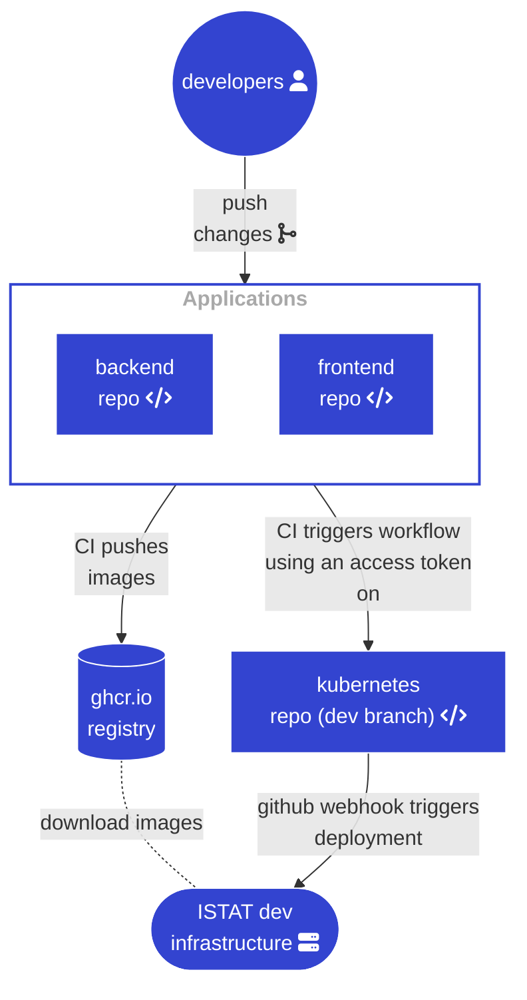

# dati-semantic-kubernetes

This is the configuration repository for the [schema.gov.it](schema.gov.it).

We use branch based environments to manage the configuration. The branch name is the environments it applies to.

## Environments

- [dev](https://github.com/teamdigitale/dati-semantic-kubernetes/tree/dev)
- [test](https://github.com/teamdigitale/dati-semantic-kubernetes/tree/test)
- [prod](https://github.com/teamdigitale/dati-semantic-kubernetes/tree/prod)

## Deliverables

The deliverables' repositories are:

- The NDC application:
  - https://github.com/teamdigitale/dati-semantic-backend
  - https://github.com/teamdigitale/dati-semantic-frontend

- Semantic viewers:
  - https://github.com/teamdigitale/dati-semantic-lodview
  - https://github.com/teamdigitale/LODE
  - https://github.com/teamdigitale/dati-semantic-WebVOWL

## Automation (Only for the `dev` environment)

Deployment to dev is automatic whenever there is a change in BE or FE app.

```mermaid
flowchart

    classDef default stroke:white,color:#fff,clusterBkg:none,fill:#3344d0
    classDef cluster font-weight: bold,fill:none,color:darkgray,stroke:#3344d0,stroke-width:2px
    classDef subgraph_padding fill:none, stroke:none, opacity:0
    classDef bounded_context stroke-dasharray:5 5

dev((developers fa:fa-user))
BE["backend\nrepo fa:fa-code"]
FE["frontend\nrepo fa:fa-code"]
KUBE["kubernetes\nrepo (dev branch) fa:fa-code"]
Registry[(ghcr.io\nregistry)]

subgraph Applications
direction TB
FE
BE
end

Registry -.- |download images| INFRA
dev -->|push\n changes fa:fa-code-merge| Applications
Applications -->|CI triggers workflow\nusing an access token\n on| KUBE
Applications -->|CI pushes\nimages| Registry
click KUBE "https://github.com/teamdigitale/dati-semantic-frontend/blob/main/.github/workflows/node.js.yml#L137" "Github Action"
KUBE --> |github webhook triggers\ndeployment| INFRA([ISTAT dev\ninfrastructure fa:fa-server])


```

Upon the schema documented above, this repository includes a scheduled GitHub Actions workflow, `update-schema-editor-images`, that keeps the Schema Editor images up to date in the `dev` environment:

- **Schedule and trigger**: runs every 6 hours and can also be started manually via `workflow_dispatch`.
- **What it checks**: queries GHCR for new **semver** tags for:
  - `ghcr.io/teamdigitale/dati-semantic-schema-editor` (frontend)
  - `ghcr.io/teamdigitale/dati-semantic-schema-editor-api` (API)
- **What it updates**: when a newer semver tag is found, it updates the image reference in:
  - `dati-semantic-schema-editor/deployment.yaml`
  - `dati-semantic-schema-editor-api/deployment.yaml`
- **How changes are delivered**: for each updated image it:
  - pushes changes to a dedicated branch (e.g. `update/schema-editor-image`, `update/schema-editor-api-image`)
  - opens or updates a pull request targeting the `dev` branch (no other branches) with a `chore:`-prefixed title.
  - if PR is ok it can be merged by maintainers so the update must be manually approved to avoid potential issues

## Promoting to `test`

This is a partially automated. Developers are expected to manually promote the `dev` configuration to `test` branch.

Once developer pushed his config changes to `test` branch, ISTAT will recieve a webhook and will start the deployment
process.

## Promoting to `prod`

This is totally manual process.
Developers are expected to manually promote the `test` configuration to `prod` branch.

Then they should request the deployment of the `prod` configuration to ISTAT over the email.
